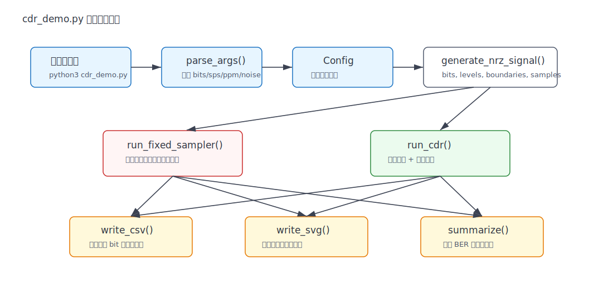
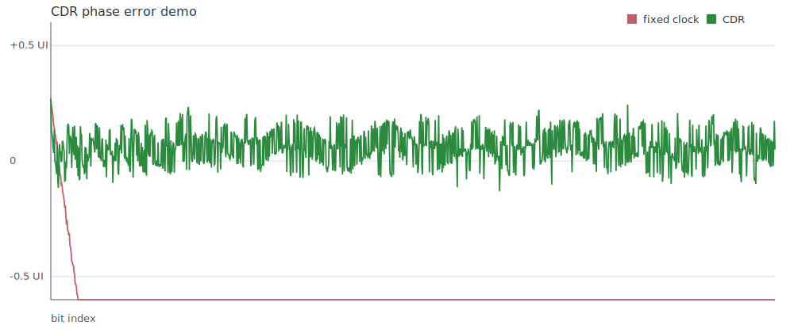
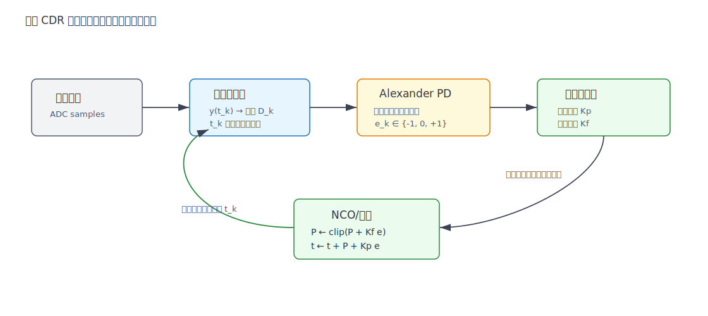
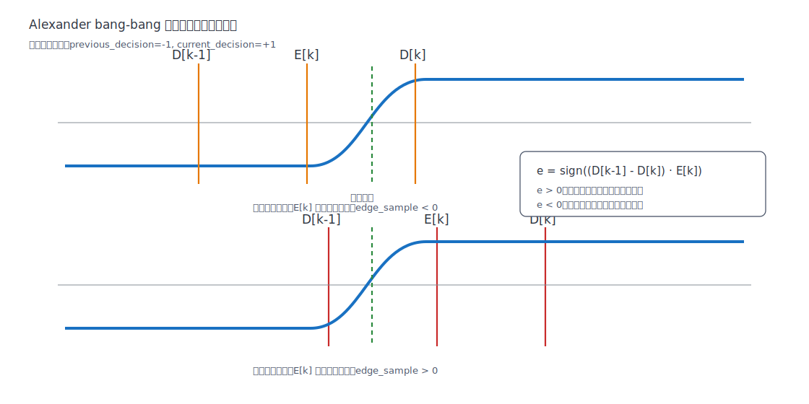

# `cdr_demo.py` 详细说明文档

本文说明 [cdr_demo.py](../cdr_demo.py) 的完整工作流程、每个函数的职责、关键代码行的作用，以及 CDR（Clock and Data Recovery，时钟数据恢复）的数字实现原理。

脚本特点：

- 纯 Python 标准库实现，无需 `numpy`、`matplotlib`。
- 生成带频偏、抖动、噪声和有限上升时间的 NRZ/PAM2 信号。
- 对比固定采样时钟和数字 CDR 环路的恢复效果。
- 输出 CSV 数据和 SVG 相位误差图。

运行命令：

```bash
python3 cdr_demo.py
```

可调参数示例：

```bash
python3 cdr_demo.py --bits 5000 --sps 16 --ppm 3000 --noise 0.12 --seed 9
```

## 1. 总体工作流程

脚本从 `main()` 开始，先解析命令行参数，再生成测试信号，然后分别用固定采样器和 CDR 采样器处理，最后输出统计结果、CSV 和 SVG。



对应代码主线：

| 步骤 | 代码位置 | 作用 |
|---|---:|---|
| 解析命令行参数 | `parse_args()`，第 340-348 行 | 读取 bit 数、采样率、频偏、噪声、随机种子、输出前缀 |
| 构造配置对象 | `main()`，第 353-360 行 | 把命令行参数封装进不可变 `Config` |
| 生成 NRZ 信号 | 第 362 行调用 `generate_nrz_signal()` | 产生 bit、真实边界、ADC 采样波形 |
| 固定采样对照 | 第 363 行调用 `run_fixed_sampler()` | 用不反馈的本地时钟采样 |
| CDR 采样恢复 | 第 364 行调用 `run_cdr()` | 用相位检测器和环路更新采样点 |
| 输出结果 | 第 366-381 行 | 写 CSV、写 SVG、打印 BER 和相位误差 |

一次默认运行的典型输出：

```text
CDR simulation finished
true UI=16.0288 ADC samples, nominal UI=16.0000 ADC samples
     fixed: BER(after lock)=0.500682, median(|phase|)=12.0430 UI, rms(phase)=13.2606 UI
       cdr: BER(after lock)=0.000000, median(|phase|)=0.0667 UI, rms(phase)=0.0957 UI
CDR average recovered UI over last 100 bits: 16.0276 ADC samples
CDR phase-detector updates: 1277
wrote: cdr_demo_output.csv
wrote: cdr_demo_phase.svg
simulated bits: 2500
```

该结果说明：

| 对象 | 现象 | 解释 |
|---|---|---|
| 固定采样器 | 锁定后 BER 约 0.5 | 发送端和接收端有频偏，采样点持续漂移，最终几乎随机判决 |
| CDR | 锁定后 BER 为 0 | 环路利用数据跳变边沿持续修正相位和频率 |
| CDR 恢复 UI | 约 16.0276 ADC samples | 接近真实 UI `16.0288`，说明频率估计被拉回 |
| CDR 相位误差 | 中位数约 0.0667 UI | 采样点保持在眼图中心附近 |

仿真生成的相位误差图：



红线是固定时钟，绿色是 CDR。图中纵轴裁剪在 `±0.6 UI`，所以固定时钟实际漂移远大于显示范围；CSV 中保留了完整相位误差。

## 2. CDR 的工作原理

CDR 的目标是：在没有单独时钟线的情况下，从接收到的数据流中恢复出“什么时候采样最可靠”。

在高速串行通信、SerDes、以太网、PCIe、USB、光通信等场景中，发送端不会额外传一根时钟线，接收端只能看到一串被信道变形后的电压波形。CDR 要做两件事：

| 任务 | 含义 |
|---|---|
| Clock Recovery | 恢复采样时钟，也就是确定每个 UI 的中心位置 |
| Data Recovery | 在恢复出的最佳时刻采样并判决 0/1 |

### 2.1 UI、眼图和采样相位

UI 是 Unit Interval，即一个 bit 周期。若采样点位于眼图中心，抗噪声和抗抖动能力最强。

本脚本中相位误差定义为：

```text
phase_ui[k] = (t_k - C_k) / T_k

C_k = 0.5 * (B_k + B_(k+1))
T_k = B_(k+1) - B_k
```

其中：

| 符号 | 含义 | 代码对应 |
|---|---|---|
| `t_k` | 第 `k` 个 bit 的实际采样时刻 | `time` |
| `B_k` | 第 `k` 个 bit 的左边界 | `boundaries[k]` |
| `B_(k+1)` | 第 `k` 个 bit 的右边界 | `boundaries[k + 1]` |
| `C_k` | bit 中心，`0.5 * (B_k + B_(k+1))` | `center` |
| `T_k` | 当前 UI 长度，`B_(k+1) - B_k` | `ui` |
| `phase_ui[k]` | 归一化相位误差，单位 UI | `phase_ui` |

代码实现见第 105-110 行：

```python
center = 0.5 * (boundaries[symbol_index] + boundaries[symbol_index + 1])
ui = boundaries[symbol_index + 1] - boundaries[symbol_index]
return (t - center) / ui
```

当 `phase_ui[k] = 0` 时，采样点正好在眼图中心；当 `abs(phase_ui[k])` 接近 `0.5` 时，采样点接近 bit 边界，误判风险变高。

### 2.2 数字 CDR 环路

本脚本中的 CDR 是一个简化的数字 PLL：



环路组成：

| 模块 | 代码位置 | 作用 |
|---|---:|---|
| 插值采样器 | `linear_interp()`，第 52-59 行 | 允许在小数采样点位置读取波形 |
| 判决器 | `run_cdr()` 第 179-180 行 | 根据采样电压正负判成 `+1/-1` |
| Alexander 相位检测器 | `run_cdr()` 第 183-187 行 | 根据数据边沿判断本地时钟早晚 |
| 频率更新 | `period = clamp(...)`，第 187 行 | 调整本地估计 UI 长度 |
| 相位更新 | `t += period + phase_gain * error`，第 202 行 | 调整下一次采样时刻 |

环路更新公式：

```text
if D_(k-1) != D_k:
    e_k = sign((D_(k-1) - D_k) * E_k)
else:
    e_k = 0

P_(k+1) = clip(P_k + K_f * e_k, P_min, P_max)
t_(k+1) = t_k + P_(k+1) + K_p * e_k
```

变量含义：

| 符号 | 代码变量 | 含义 |
|---|---|---|
| `D_(k-1)` | `previous_decision` | 上一个 bit 的判决 |
| `D_k` | `decision` | 当前 bit 的判决 |
| `E_k` | `edge_sample` | 当前采样点前半个 UI 处的边沿采样值 |
| `e_k` | `error` | bang-bang 相位误差，只能是 `-1/0/+1` |
| `P_k` | `period` | 本地估计的 UI 长度，单位 ADC samples |
| `K_f` | `freq_gain` | 频率环路增益 |
| `K_p` | `phase_gain` | 相位环路增益 |
| `t_k` | `t` | 当前采样时刻 |

### 2.3 Alexander bang-bang 相位检测器

Alexander 相位检测器常用于二值 NRZ/PAM2 CDR。它不输出连续相位误差，而是输出“早了、晚了、无信息”三种状态，所以也叫 bang-bang phase detector。



在脚本中：

```python
edge_sample = linear_interp(samples, t - 0.5 * period)
error = sgn((previous_decision - decision) * edge_sample)
```

核心逻辑：

| 数据是否翻转 | `edge_sample` 是否有意义 | `error` |
|---|---|---|
| `previous_decision == decision` | 没有边沿，无法判断早晚 | `0` |
| `previous_decision != decision` | 有边沿，可以判断早晚 | `-1` 或 `+1` |

以上升沿为例，`previous_decision=-1`，`decision=+1`：

| 采样时钟状态 | 半 UI 边沿采样 `edge_sample` | 乘积 `(D_(k-1) - D_k) * E_k` | `error` | 下一步 |
|---|---:|---:|---:|---|
| 偏早 | 小于 0 | 正 | `+1` | 下一次采样点向后推 |
| 偏晚 | 大于 0 | 负 | `-1` | 下一次采样点向前拉 |

对下降沿也成立，因为 `previous_decision - decision` 的符号会反过来。

### 2.4 为什么固定时钟会失败

发送端真实 UI 在代码里是：

```text
T_tx = S_nominal * (1 + ppm_offset * 1e-6)
```

默认参数：

```text
T_tx = 16 * (1 + 1800 * 1e-6) = 16.0288
```

固定采样器的本地周期是：

```text
P_fixed = 16 * 0.993 = 15.888
```

两者每个 bit 相差：

```text
delta_T = 16.0288 - 15.888 = 0.1408 samples/UI
```

所以固定采样点会按 bit 数持续漂移。漂移到半个 UI 附近后，采样点开始接近边沿，误码率迅速恶化。CDR 则通过数据边沿持续估计早晚，把 `period` 从初始 `15.888` 拉向真实 `16.0288`。

## 3. 信号模型和数学公式

### 3.1 bit 到 NRZ 电平

脚本把 bit 映射为 PAM2/NRZ 电平：

```text
if bit_k == 1:
    level_k = +1
else:
    level_k = -1
```

代码：

```python
levels = [1.0 if bit else -1.0 for bit in bits]
```

### 3.2 bit 边界模型

第 `k` 个边界的位置：

```text
B_k = B_0 + k * T_tx + J_sin(k) + J_rand(k)
```

其中：

```text
J_sin(k)  = 0.055 * S_nominal * sin(2 * pi * k / 310)
J_rand(k) = Gaussian(mean=0, std=0.018 * S_nominal)
```

对应代码第 81-83 行。

### 3.3 一阶低通信道

为了模拟有限带宽和边沿变慢，脚本用一阶 IIR 低通：

```text
y[n] = y[n-1] + alpha * (x[n] - y[n-1])
```

再加上高斯噪声：

```text
r[n] = y[n] + noise[n]

noise[n] = Gaussian(mean=0, std=noise_std)
```

代码第 98-100 行：

```python
raw = levels[bit_index]
y += channel_alpha * (raw - y)
samples.append(y + rng.gauss(0.0, cfg.noise_std))
```

### 3.4 小数采样点插值

CDR 的采样时刻 `t` 不是整数 ADC 样点，所以要插值：

```text
x(t) = (1 - frac) * x[i] + frac * x[i + 1]
```

其中：

```text
i = floor(t)
frac = t - i
```

代码第 57-59 行。

### 3.5 判决与 BER

二值判决：

```text
if y(t_k) >= 0:
    decision_k = +1
else:
    decision_k = -1
```

BER：

```text
BER = number_of_wrong_decisions / number_of_decisions
```

代码第 215-216 行。

## 4. 函数级说明

### 4.1 `Config`

位置：第 27-37 行。

`Config` 是一个冻结的 dataclass，用来保存仿真参数。`frozen=True` 表示对象创建后字段不能被修改，这有利于让仿真配置保持一致。

| 字段 | 默认值 | 作用 |
|---|---:|---|
| `n_bits` | `2500` | 生成的 bit 数 |
| `nominal_sps` | `16.0` | 接收端名义每 UI 的 ADC 采样点数 |
| `ppm_offset` | `1800.0` | 发送端 UI 相对接收端的频偏 |
| `initial_phase_ui` | `0.28` | 初始采样点偏离眼图中心的 UI 数 |
| `noise_std` | `0.09` | 高斯噪声标准差 |
| `seed` | `7` | 随机种子，保证结果可复现 |
| `output_prefix` | `"cdr_demo"` | 输出文件前缀 |

### 4.2 `clamp(value, lo, hi)`

位置：第 40-41 行。

作用是把数值限制在 `[lo, hi]` 范围内。CDR 中用于限制 `period`，避免环路因为噪声而跑到不合理的 UI 长度。

数学形式：

```text
clamp(x, lo, hi) = max(lo, min(hi, x))
```

### 4.3 `sgn(value)`

位置：第 44-49 行。

返回输入数值的符号：

| 输入 | 输出 |
|---:|---:|
| `value > 0` | `+1.0` |
| `value < 0` | `-1.0` |
| `value == 0` | `0.0` |

在 CDR 中，它把连续的边沿采样信息压缩成 bang-bang 相位误差。

### 4.4 `linear_interp(samples, t)`

位置：第 52-59 行。

这个函数允许在非整数时刻 `t` 读取 ADC 波形。

工作流程：

1. 检查 `t` 是否越界。
2. 取 `i=floor(t)`。
3. 取小数部分 `frac=t-i`。
4. 返回 `samples[i]` 和 `samples[i+1]` 的线性插值。

公式：

```text
x(t) = (1 - frac) * samples[i] + frac * samples[i + 1]
```

其中 `i = floor(t)`，`frac = t - i`。

### 4.5 `generate_nrz_signal(cfg)`

位置：第 62-102 行。

这是测试数据和接收波形的生成器。它输出：

| 返回值 | 类型 | 含义 |
|---|---|---|
| `bits` | `list[int]` | 原始 0/1 bit 序列 |
| `levels` | `list[float]` | 映射后的 `-1/+1` 电平 |
| `boundaries` | `list[float]` | 每个 bit 真实边界在 ADC 坐标中的位置 |
| `samples` | `list[float]` | 接收端 ADC 采样波形 |
| `true_ui` | `float` | 发送端真实 UI 长度 |

主要逻辑：

1. 用随机种子生成可复现 bit 序列。
2. 将 bit 映射为 `-1/+1`。
3. 根据 `ppm_offset` 计算真实 UI。
4. 给 bit 边界加入正弦抖动和随机抖动。
5. 根据真实边界生成 ADC 样点。
6. 用一阶低通模拟有限带宽。
7. 加入高斯噪声。

### 4.6 `phase_error_for_symbol(boundaries, symbol_index, t)`

位置：第 105-110 行。

作用：计算某个采样点相对当前 bit 中心的相位误差。

返回值单位是 UI：

| 返回值 | 含义 |
|---:|---|
| `0` | 正好在眼图中心 |
| `+0.25` | 比中心晚四分之一个 UI |
| `-0.25` | 比中心早四分之一个 UI |
| 接近 `±0.5` | 接近 bit 边界，风险高 |

### 4.7 `run_fixed_sampler(cfg, levels, boundaries, samples)`

位置：第 113-142 行。

这是对照组：使用固定周期采样，不做任何相位或频率恢复。

关键行为：

| 代码 | 含义 |
|---|---|
| `period = cfg.nominal_sps * 0.993` | 故意设置一个略偏的本地采样周期 |
| `t = boundaries[0] + ...` | 设置初始采样时刻，带初始相位偏差 |
| `linear_interp(samples, t)` | 在当前本地采样时刻读取波形 |
| `decision = 1.0 if y >= 0.0 else -1.0` | 按零阈值判决 |
| `t += period` | 下一次采样只靠固定周期推进 |

它失败的根本原因是没有反馈。只要本地周期和真实 UI 不完全相同，相位误差就会不断累积。

### 4.8 `run_cdr(cfg, levels, boundaries, samples)`

位置：第 145-205 行。

这是脚本的核心函数，实现数字 CDR。

核心变量：

| 变量 | 作用 |
|---|---|
| `period` | 当前估计的 UI 长度 |
| `t` | 当前采样时刻 |
| `phase_gain` | 相位更新步长 |
| `freq_gain` | 频率更新步长 |
| `previous_decision` | 上一个 bit 的判决 |
| `error` | Alexander 相位检测器输出 |

核心代码块：

```python
if previous_decision is not None and decision != previous_decision:
    edge_sample = linear_interp(samples, t - 0.5 * period)
    error = sgn((previous_decision - decision) * edge_sample)
    period = clamp(period + freq_gain * error, min_period, max_period)
```

解释：

1. `decision != previous_decision` 表示数据发生翻转。
2. 只有发生翻转，边沿位置才携带时钟早晚信息。
3. `t - 0.5 * period` 是估计的边沿采样位置。
4. `edge_sample` 的符号告诉我们边沿采样落在跳变前还是跳变后。
5. `sgn(...)` 输出 `+1/-1`，表示早或晚。
6. `period` 被微调，用于恢复频率。
7. 循环末尾的 `t += period + phase_gain * error` 被用来恢复相位。

### 4.9 `summarize(rows, settle=300)`

位置：第 208-220 行。

统计采样结果。默认忽略前 300 个 bit，因为 CDR 刚开始需要捕获和锁定。

输出：

| 返回值 | 含义 |
|---|---|
| `ber` | 锁定后的误码率 |
| `median_abs_phase` | 锁定后相位误差绝对值的中位数 |
| `rms_phase` | 锁定后相位误差 RMS |

### 4.10 `format_summary(name, rows)`

位置：第 223-229 行。

调用 `summarize()`，并把统计量格式化为一行可读文本。

### 4.11 `write_csv(path, fixed, cdr)`

位置：第 232-265 行。

把固定采样器和 CDR 的逐 bit 结果写入 CSV。

CSV 字段：

| 字段 | 含义 |
|---|---|
| `k` | bit 序号 |
| `fixed_time` | 固定采样器采样时刻 |
| `fixed_decision` | 固定采样器判决结果 |
| `fixed_phase_ui` | 固定采样器相位误差 |
| `cdr_time` | CDR 采样时刻 |
| `cdr_decision` | CDR 判决结果 |
| `cdr_phase_ui` | CDR 相位误差 |
| `cdr_error` | CDR 相位检测器输出 |
| `cdr_period` | CDR 当前估计 UI |

### 4.12 `decimated_points(rows, max_points=1000)`

位置：第 268-271 行。

SVG 折线图不需要画全部 2500 个点。这个函数按步长抽样，最多返回约 1000 个点，减少 SVG 文件体积。

### 4.13 `svg_polyline(rows, width, height, color)`

位置：第 274-293 行。

把相位误差数据转换成 SVG `<polyline>` 字符串。

关键处理：

| 代码逻辑 | 作用 |
|---|---|
| 设置 `margin_*` | 留出坐标轴和标签空间 |
| `y_min=-0.6`, `y_max=0.6` | 把显示范围限制在 `±0.6 UI` |
| `phase = clamp(...)` | 超出显示范围的相位误差被裁剪 |
| `x = ... i / n` | bit 序号映射到 SVG 横坐标 |
| `y = ...` | 相位误差映射到 SVG 纵坐标 |

### 4.14 `write_svg(path, fixed, cdr)`

位置：第 296-337 行。

生成一个轻量 SVG 图，不依赖 matplotlib。

它完成：

1. 创建 SVG 画布。
2. 绘制 `+0.5 UI`、`0`、`-0.5 UI` 网格线。
3. 绘制坐标轴。
4. 绘制固定采样器相位误差折线。
5. 绘制 CDR 相位误差折线。
6. 绘制图例。
7. 写入文件。

### 4.15 `parse_args()`

位置：第 340-348 行。

使用 `argparse` 定义命令行参数。

| 参数 | 默认值 | 作用 |
|---|---:|---|
| `--bits` | `2500` | 仿真的 bit 数 |
| `--sps` | `16.0` | 名义每 UI 采样点数 |
| `--ppm` | `1800.0` | 发送端频偏 |
| `--noise` | `0.09` | 噪声标准差 |
| `--seed` | `7` | 随机种子 |
| `--prefix` | `cdr_demo` | 输出文件前缀 |

### 4.16 `main()`

位置：第 351-384 行。

顶层编排函数，负责把所有模块串起来。

执行顺序：

1. `args = parse_args()` 读取参数。
2. 创建 `Config`。
3. 调用 `generate_nrz_signal()` 生成信号。
4. 调用 `run_fixed_sampler()` 生成固定采样结果。
5. 调用 `run_cdr()` 生成 CDR 结果。
6. 创建输出文件路径。
7. 写 CSV。
8. 写 SVG。
9. 统计 CDR 最后 100 个 bit 的平均恢复周期。
10. 统计相位检测器实际更新次数。
11. 打印运行结果。

### 4.17 `if __name__ == "__main__":`

位置：第 387-388 行。

保证当文件被直接运行时调用 `main()`；如果这个文件被其他 Python 文件 `import`，则不会自动执行仿真。

## 5. 按行号拆解代码

说明：空行只用于分隔逻辑块，下面不单独列出。连续几行完成同一动作时以行号范围说明。

| 行号 | 作用 |
|---:|---|
| 1 | 指定用系统环境中的 `python3` 运行该脚本 |
| 2 | 声明源码编码为 UTF-8，支持中文注释和文档字符串 |
| 3-13 | 文件级文档字符串，说明 CDR 示例的用途、输出和运行方式 |
| 15 | 启用延迟类型注解，避免某些类型在运行时立即求值 |
| 17 | 导入 `argparse`，用于命令行参数解析 |
| 18 | 导入 `csv`，用于写输出数据表 |
| 19 | 导入 `math`，用于三角函数、开方、取整等数学操作 |
| 20 | 导入 `random`，用于生成 bit、抖动和噪声 |
| 21 | 导入 `statistics`，用于均值、中位数统计 |
| 22 | 导入 `dataclass`，用于定义配置对象 |
| 23 | 导入 `Path`，用于跨平台处理输出文件路径 |
| 24 | 导入 `Iterable`，用于函数返回类型标注 |
| 27 | 给 `Config` 加 `@dataclass(frozen=True)` 装饰器 |
| 28 | 定义 `Config` 类 |
| 29 | `Config` 的说明文字，解释 UI 是一个 bit 周期 |
| 31 | 设置默认 bit 数为 2500 |
| 32 | 设置接收端名义采样率为每 UI 16 点 |
| 33 | 设置发送端相对频偏为 1800 ppm |
| 34 | 设置初始采样点偏离中心 0.28 UI |
| 35 | 设置噪声标准差 |
| 36 | 设置随机种子 |
| 37 | 设置输出文件名前缀 |
| 40 | 定义 `clamp()` 的函数签名 |
| 41 | 返回被限制在 `[lo, hi]` 区间内的值 |
| 44 | 定义 `sgn()` 的函数签名 |
| 45-46 | 输入为正时返回 `+1.0` |
| 47-48 | 输入为负时返回 `-1.0` |
| 49 | 输入为零时返回 `0.0` |
| 52 | 定义 `linear_interp()` 的函数签名 |
| 53 | 函数说明：对 ADC 离散样点做线性插值 |
| 55-56 | 越界时返回 `nan`，避免访问非法样点 |
| 57 | 取采样时刻左侧整数下标 |
| 58 | 计算采样时刻的小数部分 |
| 59 | 返回两点线性插值结果 |
| 62 | 定义 `generate_nrz_signal()`，返回 bit、波形和真实 UI |
| 63-68 | 函数文档，说明输出对象的意义 |
| 70 | 用配置中的随机种子创建随机数发生器 |
| 71 | 生成随机 0/1 bit 序列 |
| 72 | 把 bit 映射成 NRZ/PAM2 电平 `-1/+1` |
| 74 | 注释说明 `true_ui` 的意义 |
| 75 | 根据 ppm 频偏计算发送端真实 UI |
| 76 | 让波形从第 10 个名义 UI 后开始，给前面留空余 |
| 78 | 注释说明接下来要给边界加抖动 |
| 79 | 初始化 bit 边界数组 |
| 80 | 循环生成 `n_bits+1` 个 bit 边界 |
| 81 | 生成低频正弦抖动 |
| 82 | 生成随机高斯抖动 |
| 83 | 计算第 `k` 个真实 bit 边界 |
| 84-85 | 防止抖动导致边界过近或倒序 |
| 86 | 保存当前边界 |
| 88 | 注释说明接下来生成 ADC 波形 |
| 89 | 根据最后一个边界计算需要的 ADC 样点总数 |
| 90 | 初始化 ADC 样点数组 |
| 91 | 初始化当前 bit 下标 |
| 92 | 设置一阶低通系数 |
| 93 | 把低通状态初始化为第一个 bit 电平 |
| 95 | 遍历每一个整数 ADC 采样时刻 |
| 96-97 | 如果采样时刻越过下一个真实边界，则推进 bit 下标 |
| 98 | 取当前 bit 的理想 NRZ 电平 |
| 99 | 用一阶低通更新信道输出 |
| 100 | 给信道输出叠加高斯噪声并保存 |
| 102 | 返回原始 bit、映射电平、边界、采样波形和真实 UI |
| 105 | 定义 `phase_error_for_symbol()` |
| 106 | 函数说明：返回采样点相对 bit 中心的 UI 误差 |
| 108 | 计算当前 bit 的真实中心 |
| 109 | 计算当前 bit 的真实 UI 长度 |
| 110 | 返回归一化相位误差 |
| 113-118 | 定义 `run_fixed_sampler()` 的函数签名和输入 |
| 119 | 函数说明：固定采样器是 CDR 的对照组 |
| 121 | 设置故意偏差的固定采样周期 |
| 122 | 设置初始采样时刻 |
| 123 | 初始化结果列表 |
| 125 | 按 bit 序号循环采样 |
| 126-127 | 若即将越过波形末尾则停止 |
| 128 | 在当前采样时刻插值读取波形 |
| 129 | 用零阈值完成二值判决 |
| 130-139 | 保存当前 bit 的采样时间、判决、真实值和相位误差 |
| 140 | 固定推进到下一个采样时刻 |
| 142 | 返回固定采样器结果 |
| 145-150 | 定义 `run_cdr()` 的函数签名和输入 |
| 151-162 | 函数文档，解释 CDR、Alexander 检测器和环路增益 |
| 164 | 设置 CDR 初始估计 UI，故意带一点频率误差 |
| 165 | 设置 CDR 初始采样时刻 |
| 167 | 设置相位增益，决定单次早晚纠正的相位步长 |
| 168 | 设置频率增益，决定 UI 估计更新速度 |
| 169-170 | 设置 UI 估计的上下限 |
| 172 | 初始化上一个 bit 判决为空 |
| 173 | 初始化 CDR 结果列表 |
| 175 | 按 bit 序号循环处理 |
| 176-177 | 检查当前采样点和半 UI 边沿采样点是否仍在波形范围内 |
| 179 | 在当前 CDR 采样时刻插值读取波形 |
| 180 | 用零阈值判决当前 bit |
| 181 | 默认相位检测误差为 0 |
| 183 | 注释说明只有翻转处有相位信息 |
| 184 | 判断是否已经有上一个判决，且当前 bit 与上一个 bit 不同 |
| 185 | 在当前采样点前半个 UI 的位置读取边沿采样 |
| 186 | 使用 Alexander 公式得到早晚误差 |
| 187 | 根据误差更新估计 UI，并用 `clamp()` 限幅 |
| 189-200 | 保存当前 bit 的采样、判决、相位误差、环路误差和估计周期 |
| 202 | 更新下一次采样时刻，同时加入相位修正 |
| 203 | 把当前判决保存为下一轮的上一个判决 |
| 205 | 返回 CDR 结果 |
| 208 | 定义 `summarize()` |
| 209 | 函数说明：忽略捕获阶段，统计锁定后的结果 |
| 211 | 如果数据足够长，丢弃前 `settle` 个结果 |
| 212-213 | 没有可统计数据时返回零 |
| 215 | 统计判决错误数量 |
| 216 | 计算 BER |
| 217 | 取出有限的相位误差值 |
| 218 | 计算相位误差绝对值中位数 |
| 219 | 计算相位误差 RMS |
| 220 | 返回三个统计量 |
| 223 | 定义 `format_summary()` |
| 224 | 调用 `summarize()` 得到统计量 |
| 225-229 | 把 BER、中位相位误差、RMS 相位误差格式化为字符串 |
| 232 | 定义 `write_csv()` |
| 233 | 函数说明：写两种采样方式的关键数据 |
| 235-245 | 定义 CSV 列名 |
| 247 | 以 UTF-8 和 newline 安全模式打开输出文件 |
| 248 | 创建 `csv.DictWriter` |
| 249 | 写 CSV 表头 |
| 250 | 按固定采样器和 CDR 中较长的结果长度循环 |
| 251 | 取固定采样器当前行，不存在则用空字典 |
| 252 | 取 CDR 当前行，不存在则用空字典 |
| 253-265 | 写入一行对齐后的固定采样和 CDR 数据 |
| 268 | 定义 `decimated_points()` |
| 269 | 根据最大点数计算抽样步长 |
| 270-271 | 按步长产出折线图需要的点 |
| 274 | 定义 `svg_polyline()` |
| 275 | 函数说明：生成相位误差折线 |
| 277-280 | 设置 SVG 图的边距 |
| 281-282 | 计算绘图区宽高 |
| 283-284 | 设置相位误差显示范围 |
| 285 | 计算横轴归一化分母，防止除零 |
| 287 | 初始化 SVG 点坐标列表 |
| 288 | 遍历抽样后的相位误差点 |
| 289 | 把相位误差裁剪到显示范围 |
| 290 | 把 bit 序号映射到 SVG 横坐标 |
| 291 | 把相位误差映射到 SVG 纵坐标 |
| 292 | 保存当前点的 SVG 坐标 |
| 293 | 返回 SVG `<polyline>` 元素字符串 |
| 296 | 定义 `write_svg()` |
| 297 | 函数说明：不用 matplotlib，直接写 SVG |
| 299-300 | 设置 SVG 画布尺寸 |
| 301-304 | 设置图像边距 |
| 305-306 | 计算绘图区宽高 |
| 308 | 定义内部函数 `y_for_phase()` |
| 309 | 把相位误差转换为 SVG 纵坐标 |
| 311 | 初始化网格线元素列表 |
| 312 | 遍历 `+0.5 UI`、`0`、`-0.5 UI` 三条参考线 |
| 313 | 计算参考线纵坐标 |
| 314-317 | 添加一条水平网格线 |
| 318-320 | 添加该网格线的文字标签 |
| 322-335 | 拼接完整 SVG，包括背景、标题、网格、坐标轴、两条折线和图例 |
| 337 | 把 SVG 字符串写入文件 |
| 340 | 定义 `parse_args()` |
| 341 | 创建命令行参数解析器 |
| 342 | 添加 `--bits` 参数 |
| 343 | 添加 `--sps` 参数 |
| 344 | 添加 `--ppm` 参数 |
| 345 | 添加 `--noise` 参数 |
| 346 | 添加 `--seed` 参数 |
| 347 | 添加 `--prefix` 参数 |
| 348 | 解析并返回命令行参数 |
| 351 | 定义 `main()` |
| 352 | 调用 `parse_args()` |
| 353-360 | 根据命令行参数构造 `Config` |
| 362 | 生成测试信号 |
| 363 | 运行固定采样器 |
| 364 | 运行 CDR |
| 366 | 生成 CSV 输出路径 |
| 367 | 生成 SVG 输出路径 |
| 368 | 写 CSV 文件 |
| 369 | 写 SVG 文件 |
| 371 | 计算 CDR 最后 100 个 bit 的平均恢复 UI |
| 372 | 统计 CDR 相位检测器实际更新次数 |
| 374 | 打印仿真完成提示 |
| 375 | 打印真实 UI 和名义 UI |
| 376 | 打印固定采样器统计结果 |
| 377 | 打印 CDR 统计结果 |
| 378 | 打印 CDR 最后阶段平均恢复周期 |
| 379 | 打印 CDR 更新次数 |
| 380 | 打印 CSV 文件路径 |
| 381 | 打印 SVG 文件路径 |
| 383 | 注释说明为何打印 bit 数 |
| 384 | 打印仿真 bit 数 |
| 387 | 判断当前文件是否作为主程序运行 |
| 388 | 作为主程序运行时调用 `main()` |

## 6. CDR 环路参数如何影响结果

| 参数 | 代码变量 | 增大后的效果 | 过大风险 |
|---|---|---|---|
| 相位增益 | `phase_gain` | 锁定更快，对相位误差纠正更激进 | 抖动传递更大，采样点左右晃动 |
| 频率增益 | `freq_gain` | 频偏跟踪更快 | 周期估计被噪声扰动 |
| 周期上下限 | `min_period/max_period` | 限制异常频率估计 | 太窄可能锁不到真实频率 |
| 初始相位 | `initial_phase_ui` | 改变捕获难度 | 太靠近边沿会增加早期误判 |
| 噪声 | `noise_std` | 更接近真实信道 | 太大可能导致判决和相位检测错误 |

本脚本参数偏向“教学可观察”：初始周期故意设错，频偏也设置得比较明显，让固定采样明显失败，而 CDR 的锁定过程容易在图里看出来。

## 7. 输出文件如何解读

### 7.1 `cdr_demo_output.csv`

这个文件适合做进一步分析，例如：

- 查看 `cdr_period` 是否收敛到真实 UI。
- 查看 `cdr_error` 的 `+1/-1` 分布。
- 对比 `fixed_phase_ui` 和 `cdr_phase_ui` 的漂移。
- 计算不同 `settle` 时间后的 BER。

示意：

| 列 | 读法 |
|---|---|
| `fixed_phase_ui` 持续变大或变小 | 固定采样点在漂移 |
| `cdr_phase_ui` 围绕 0 波动 | CDR 锁定在眼图中心附近 |
| `cdr_period` 接近 `true UI` | CDR 完成频率恢复 |
| `cdr_error` 常为 0 | 当前 bit 与上一个 bit 未翻转，边沿无信息 |

### 7.2 `cdr_demo_phase.svg`

这个图只显示 `±0.6 UI` 范围内的相位误差：

- 绿色 CDR 曲线如果贴近 `0 UI`，说明采样点位于眼图中心附近。
- 红色 fixed 曲线如果贴边或离开中心，说明固定采样正在漂移。
- 若绿色曲线持续贴近 `+0.5 UI` 或 `-0.5 UI`，说明 CDR 参数可能不合适或噪声太大。

## 8. 这份仿真和真实硬件 CDR 的对应关系

| 仿真代码 | 真实系统中的对应模块 |
|---|---|
| `samples` | ADC 或比较器采样后的接收波形 |
| `linear_interp()` | 小数间隔插值器、Farrow 插值器或相位选择器 |
| `decision` | slicer 判决输出 |
| `edge_sample` | 边沿采样点或 early/late 采样点 |
| `error` | 相位检测器输出 |
| `phase_gain/freq_gain` | 数字环路滤波器系数 |
| `period` | NCO 频率控制字或本地 UI 估计 |
| `t` | 下一次采样相位 |

真实 SerDes 中还可能有：

- 均衡器，如 CTLE、DFE、FFE。
- 更复杂的时钟插值器。
- 更稳健的锁定检测。
- 更严格的环路带宽设计。
- 多相采样时钟或全速/半速架构。

本脚本保留的是最核心的 CDR 思想：从数据翻转中提取相位信息，再反馈控制本地采样时钟。

## 9. 建议实验

可以修改命令行参数观察环路行为：

| 实验 | 命令 | 观察点 |
|---|---|---|
| 增大频偏 | `python3 cdr_demo.py --ppm 5000` | CDR 是否仍能把 `cdr_period` 拉向真实 UI |
| 增大噪声 | `python3 cdr_demo.py --noise 0.2` | BER 和相位误差是否上升 |
| 增加 bit 数 | `python3 cdr_demo.py --bits 10000` | 固定采样漂移更明显 |
| 改随机种子 | `python3 cdr_demo.py --seed 123` | 不同数据翻转密度对 CDR 更新次数的影响 |
| 改输出前缀 | `python3 cdr_demo.py --prefix test1` | 生成 `test1_output.csv` 和 `test1_phase.svg` |

如果想进一步扩展代码，可以考虑：

- 加入 PRBS 生成器替代完全随机 bit。
- 加入眼图绘制。
- 把 Alexander PD 改成 Mueller-Muller timing recovery。
- 加入 PAM4 判决和多电平 CDR。
- 用真实采样数据替换 `generate_nrz_signal()` 的仿真数据。
