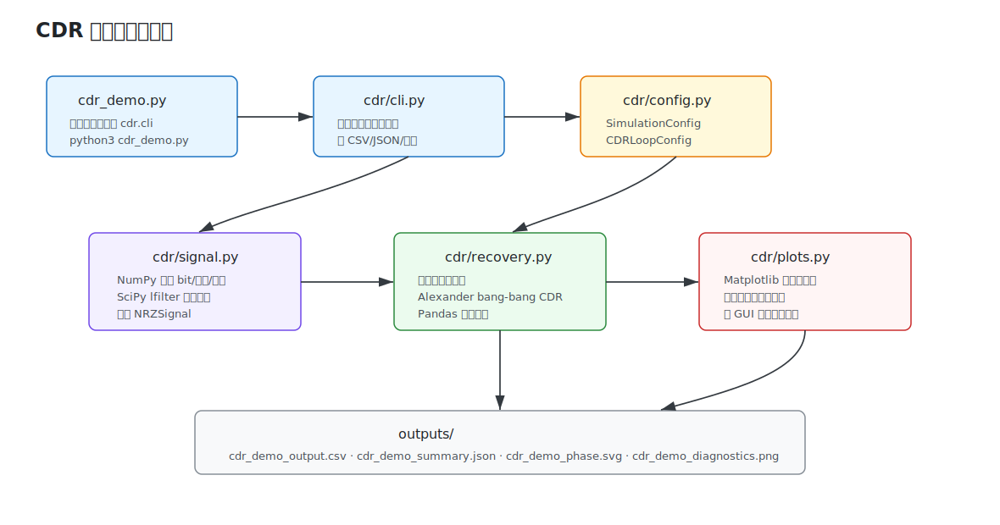

# CDR Demo 工程说明与原理文档

本文对应当前重构后的 `CDR` 项目。项目已经从单文件脚本升级为模块化工程，使用 `numpy`、`scipy`、`pandas`、`matplotlib` 完成信号生成、环路恢复、数据统计和可视化。

## 1. 项目目标

本项目演示数字信号处理中的 CDR，也就是 Clock and Data Recovery，时钟数据恢复。接收端只看到一串被信道、噪声、抖动污染后的数据波形，没有单独时钟线；CDR 的任务是从数据跳变中恢复采样时钟，并在眼图中心附近完成数据判决。

项目默认对比两条路径：

| 路径 | 作用 | 预期表现 |
|---|---|---|
| 固定采样器 | 本地时钟自由运行，不做反馈 | 有频偏时采样相位持续漂移，误码率接近随机 |
| Alexander CDR | 用数据跳变判断早晚，反馈更新采样相位和周期 | 采样点锁到眼图中心附近，周期估计接近真实 UI |

## 2. 当前文件构成规则



| 路径 | 类型 | 职责 |
|---|---|---|
| `cdr_demo.py` | 入口脚本 | 保持原有运行方式，内部只调用 `cdr.cli.main()` |
| `cdr/__init__.py` | 包入口 | 暴露常用配置、信号生成和恢复函数 |
| `cdr/config.py` | 配置层 | 定义 `SimulationConfig`、`CDRLoopConfig`、`OutputConfig` |
| `cdr/signal.py` | 信号模型 | 用 NumPy 生成 bit、边界、抖动、噪声；用 SciPy 一阶 IIR 模拟信道 |
| `cdr/recovery.py` | CDR 算法 | 固定采样器、Alexander CDR、统计汇总、CSV 表格合并 |
| `cdr/plots.py` | 可视化 | 用 Matplotlib 输出相位误差图、诊断面板和眼图视图 |
| `cdr/cli.py` | 命令行编排 | 参数解析、调用仿真、写 CSV/JSON/图片、打印摘要 |
| `docs/` | 文档 | CDR 原理、项目结构、图示 |
| `outputs/` | 运行输出 | 默认生成 CSV、JSON、SVG、PNG；该目录被 git 忽略 |
| `UPDATE_LOG.md` | 更新记录 | 每次提交前必须更新 |
| `requirements.txt` | 依赖版本 | 固定项目依赖，便于重建环境 |

工程规则：

1. `cdr/` 目录只放可复用 Python 代码。
2. `docs/` 目录只放解释文档和说明图。
3. `outputs/` 目录只放运行生成物，不提交到 git。
4. 每次有功能、文档、依赖或结构变化，都先更新 `UPDATE_LOG.md`，再提交。
5. 提交信息必须说明具体更新点，避免只写 `initial commit`、`update`、`fix` 这类含糊备注。

## 3. 运行方式

```bash
python3 cdr_demo.py
```

默认输出：

```text
outputs/cdr_demo_output.csv
outputs/cdr_demo_summary.json
outputs/cdr_demo_phase.svg
outputs/cdr_demo_diagnostics.png
```

常用参数：

```bash
python3 cdr_demo.py --bits 5000 --ppm 3000 --noise 0.12
python3 cdr_demo.py --phase-gain-ui 0.08 --freq-gain-ui 0.0005
python3 cdr_demo.py --prefix experiment_01 --output-dir outputs
```

模块入口也可以直接运行：

```bash
python3 -m cdr.cli --no-plots
```

若要安装 `cdr-demo` 命令，在 Homebrew 管理的 Python 上使用：

```bash
python3 -m pip install --user --break-system-packages -e .
cdr-demo
```

## 4. CDR 核心概念


### 4.1 UI 与采样相位

UI 是 Unit Interval，也就是一个 bit 的时间宽度。若第 `k` 个 bit 的真实左边界是 `B_k`，右边界是 `B_(k+1)`，则：

```text
C_k = 0.5 * (B_k + B_(k+1))
T_k = B_(k+1) - B_k
phase_ui[k] = (t_k - C_k) / T_k
```

含义：

| 值 | 含义 |
|---:|---|
| `phase_ui = 0` | 采样点在眼图中心，最安全 |
| `phase_ui > 0` | 采样偏晚 |
| `phase_ui < 0` | 采样偏早 |
| `abs(phase_ui) ≈ 0.5` | 接近 bit 边界，误判风险高 |

### 4.2 为什么需要 CDR

发送端真实 UI 默认是：

```text
true_ui = nominal_sps * (1 + ppm_offset * 1e-6)
        = 16 * (1 + 1800 * 1e-6)
        = 16.0288 samples/UI
```

CDR 和固定采样器的初始本地周期默认是：

```text
initial_period = nominal_sps * 0.993
               = 15.888 samples/UI
```

每个 UI 的误差约为：

```text
delta = true_ui - initial_period
      = 0.1408 samples/UI
```

这个误差会随 bit 数累积。固定采样器没有反馈，所以迟早漂到边沿；CDR 会利用数据跳变估计“早了还是晚了”，再反馈修正本地采样时刻。

## 5. 信号生成模型

`cdr/signal.py` 使用向量化方式生成接收端看到的波形。

### 5.1 bit 到 PAM2/NRZ 电平

```text
bit = 1 -> level = +1
bit = 0 -> level = -1
```

代码中对应：

```python
bits = rng.integers(0, 2, size=cfg.n_bits, dtype=np.int8)
levels = np.where(bits == 1, 1.0, -1.0).astype(float)
```

### 5.2 bit 边界

每个真实边界包含频偏、低频正弦抖动和随机抖动：

```text
B_k = start + k * true_ui + J_sin(k) + J_rand(k)

J_sin(k)  = sinusoidal_jitter_ui * nominal_sps * sin(2*pi*k/jitter_period_bits)
J_rand(k) = Gaussian(0, random_jitter_ui * nominal_sps)
```

边界生成后会强制单调递增，防止极端抖动造成边界倒序。

### 5.3 信道低通与噪声

信道用一阶 IIR 模拟有限带宽：

```text
y[n] = y[n-1] + alpha * (x[n] - y[n-1])
```

再加入高斯噪声：

```text
r[n] = y[n] + Gaussian(0, noise_std)
```

重构后使用 `scipy.signal.lfilter()` 完成该 IIR 滤波，更清晰也更接近真实信号处理写法。

## 6. Alexander Bang-Bang CDR


### 6.1 判决采样

CDR 在当前估计时刻 `t_k` 取样：

```text
sample_k = waveform(t_k)

if sample_k >= 0:
    D_k = +1
else:
    D_k = -1
```

`waveform(t_k)` 是线性插值结果，因为 `t_k` 往往是小数 ADC 采样点。

### 6.2 为什么只在翻转处更新

如果 `D_(k-1) == D_k`，说明连续两个 bit 判决相同，中间没有可靠边沿信息。此时无法判断采样时钟早晚：

```text
if D_(k-1) == D_k:
    error = 0
```

如果 `D_(k-1) != D_k`，说明中间存在跳变。CDR 读取半 UI 处的边沿采样：

```text
E_k = waveform(t_k - 0.5 * period)
```

### 6.3 Alexander 相位检测公式

当前项目采用：

```text
error = sign((D_(k-1) - D_k) * E_k)
```

解释：

| 情况 | `error` | 意义 |
|---|---:|---|
| `+1` | 正 | 本地时钟偏早，下一次采样向后推 |
| `-1` | 负 | 本地时钟偏晚，下一次采样向前拉 |
| `0` | 零 | 没有翻转，或边沿样值刚好为 0 |

以上升沿为例：

| 状态 | `D_(k-1)` | `D_k` | `E_k` | 结果 |
|---|---:|---:|---:|---|
| 时钟偏早 | `-1` | `+1` | 小于 0 | `error = +1` |
| 时钟偏晚 | `-1` | `+1` | 大于 0 | `error = -1` |

下降沿时 `D_(k-1)-D_k` 的符号会反过来，所以同一个公式仍然成立。

### 6.4 二阶数字环路

CDR 同时修正相位和周期：

```text
period = clip(period + freq_gain * error, period_min, period_max)
t_next = t_current + period + phase_gain * error
```

其中：

| 参数 | 代码变量 | 作用 |
|---|---|---|
| 相位增益 | `phase_gain_ui` | 让下一次采样点快速靠近眼图中心 |
| 频率增益 | `freq_gain_ui` | 让估计 UI 逐步靠近真实 UI |
| 周期限幅 | `min_period_scale/max_period_scale` | 防止噪声导致环路跑飞 |

直觉上：

- `phase_gain_ui` 越大，锁定更快，但相位抖动可能更大。
- `freq_gain_ui` 越大，频偏跟踪更快，但周期估计更容易受噪声影响。
- 两个增益太小，环路会很慢，甚至跟不上频偏和抖动。

## 7. 输出数据如何解读

### 7.1 CSV

`outputs/cdr_demo_output.csv` 同时保存固定采样器和 CDR 的结果。字段前缀：

| 前缀 | 含义 |
|---|---|
| `fixed_` | 固定采样器 |
| `cdr_` | Alexander CDR |

重点字段：

| 字段 | 含义 |
|---|---|
| `*_time` | 采样时刻，单位 ADC sample |
| `*_sample` | 采样电压 |
| `*_decision` | 判决值，`+1/-1` |
| `*_actual` | 真实发送电平 |
| `*_phase_ui` | 采样相位误差，单位 UI |
| `cdr_error` | CDR 相位检测器输出 |
| `cdr_period` | CDR 当前估计 UI |
| `cdr_transition` | 当前是否检测到数据翻转 |

### 7.2 JSON

`outputs/cdr_demo_summary.json` 保存可机器读取的摘要：

| 字段 | 含义 |
|---|---|
| `ber` | 锁定后的误码率 |
| `median_abs_phase_ui` | 锁定后的相位误差绝对值中位数 |
| `rms_phase_ui` | 锁定后的相位 RMS |
| `mean_period` | 锁定后的平均估计 UI |
| `period_error_ppm` | 平均估计 UI 相对真实 UI 的 ppm 误差 |
| `phase_detector_updates` | 锁定后相位检测器实际更新次数 |

终端摘要也会打印 `period_error`。固定采样器通常保持很大的周期误差；CDR 若成功锁定，该误差会明显收敛到接近 0 ppm。

### 7.3 图像

| 文件 | 内容 |
|---|---|
| `outputs/cdr_demo_phase.svg` | 固定采样与 CDR 的相位误差对比 |
| `outputs/cdr_demo_diagnostics.png` | 接收波形、相位误差、周期收敛、眼图视图 |

## 8. 和真实硬件 CDR 的对应关系

| 项目代码 | 硬件/系统对应 |
|---|---|
| `samples` | ADC 或比较器采样后的接收波形 |
| `_sample_at()` | 小数延迟插值器、多相采样器或时钟相位选择器 |
| `decision` | slicer 判决输出 |
| `edge_sample` | 边沿采样点 |
| `error` | Alexander 相位检测器输出 |
| `phase_gain/freq_gain` | 数字环路滤波器系数 |
| `period` | NCO 频率控制字或本地 UI 估计 |
| `t` | 下一次采样相位 |

真实系统还会有 CTLE、FFE、DFE、AGC、锁定检测、环路带宽设计、时钟插值器和多相采样时钟。本 demo 聚焦 CDR 最核心的闭环逻辑。

## 9. 维护与 git 规则

当前项目维护规则保持不变：

1. 每次提交前更新 `UPDATE_LOG.md`。
2. 提交信息必须简明说明本次具体变更。
3. 运行输出放在 `outputs/`，不提交。
4. 依赖变化同步更新 `requirements.txt`。
5. 结构变化同步更新 `README.md` 和本文档。

推荐提交信息示例：

```text
Refactor CDR demo into NumPy-based analysis package
Document CDR loop gains and generated output structure
Add diagnostics plots for timing recovery analysis
```
